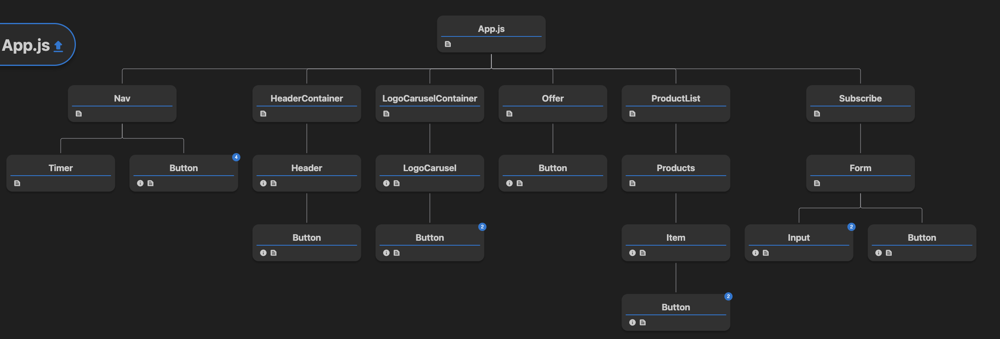

### Key Features:

Logo Carousel: The homepage of the website features a captivating logo carousel that dynamically displays logos of various companies. Users can navigate through the carousel using left and right arrows.

Timer Countdown: The website includes a timer countdown that displays the remaining time for a special promotion. The countdown dynamically updates to show the number of days, hours, minutes, and seconds left until the promotion ends.

Product List: The product list section showcases a collection of products with captivating images and brief descriptions. Users can browse through the products and explore further details.

Subscription Form: To stay updated with the latest offers and promotions, visitors can subscribe by providing their email address and phone number through a subscription form. The form performs client-side validation to ensure the correctness of the provided information.

### Technology Stack:

React.js: The website is built using the React.js library, which provides a robust and efficient way to create interactive user interfaces.

Redux: Redux is utilized to manage the application state and enable smooth data flow between components.

React Icons: Icons from the React Icons library are incorporated to enhance the visual presentation and improve user experience.

React Hook Form: React Hook Form is employed to simplify form management and validation.

